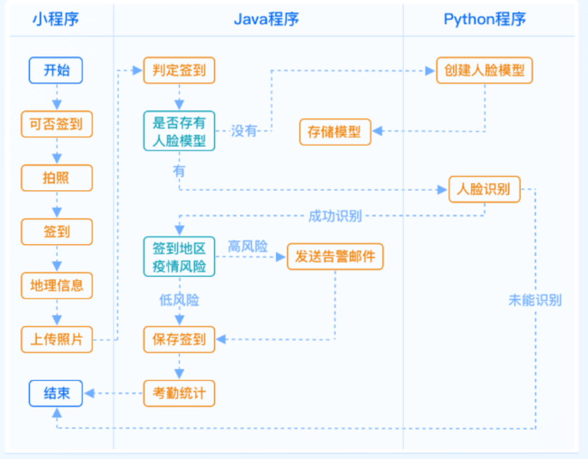

<h1 align="center" style="margin: 30px 0 30px; font-weight: bold;">在线协同办公微信小程序</h1>
<h4 align="center">springboot+微信小程序</h4>

## 系统简介

未来，在线协同办公将成为一种常态化的工作方式。在线协同办公微信小程序采用主流的前后端分离架构设计，应用 SpringBoot+uniapp 技术栈开发一款在线协同办公的小程序。

## 核心业务

## 签到逻辑

微信小程序  开始--->可否签到--->拍照--->签到--->地理信息--->上传照片

Java程序 判定签到--->是否存有人脸模型--->有，则调用python人脸识别模块--->无，则调用人脸存储模型存储--->考勤统计

python程序  人脸检测模块  

## 小结
1. 利用Maven创建SpringBoot项目
2. 配置MYSQL,MongoDB和Redis数据源
3. 整合SSM框架
4. 自定义异常类和封装结果集
5. 集成Swagger，便于web测试
6. 配置后端验证功能
7. 抵御xss跨站脚本攻击
8. 整合Shiro和JWT
9. 实现令牌自动刷新
10. 精简返回给客户端的异常内容