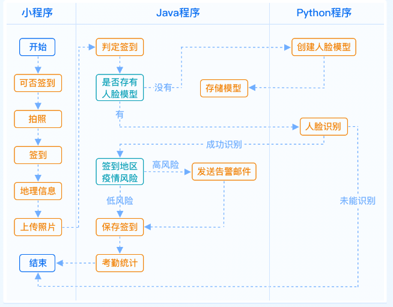

<h1 align="center" style="margin: 30px 0 30px; font-weight: bold;">在线协同办公微信小程序</h1>
<h4 align="center">springboot+微信小程序</h4>

## 系统简介

未来，在线协同办公将成为一种常态化的工作方式。在线协同办公微信小程序采用主流的前后端分离架构设计，应用 SpringBoot+uniapp 技术栈开发一款在线协同办公的小程序。

## 核心业务

## 签到逻辑

